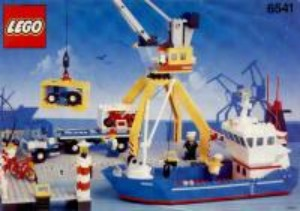
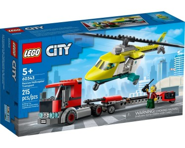

# LEGO City

[Téma CITY](https://www.lego.com/en-us/themes/city) — každodenní město: vozidla, pracoviště, pobřežní stráž, letiště. Vhodné pro role-play a společné město.

Katalog: [Rebrickable — City](https://rebrickable.com/sets/city/)

## Sety

### Intercoastal Seaport (6541)

- 1990 Town / Nautica — přístav se lodí, portálovým jeřábem a nákladním autem
- [Brick Instructions — 6541](https://lego.brickinstructions.com/lego_instructions/set/6541/Intercoastal_Seaport)
- [Rebrickable — 6541-1](https://rebrickable.com/sets/6541-1/intercoastal-seaport/)

### Rescue Helicopter Transport (60343)

- 2022 City letadlo + nákladní auto
- [Rebrickable — 60343-1](https://rebrickable.com/sets/60343-1/rescue-helicopter-transport/)

