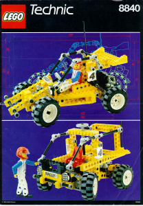
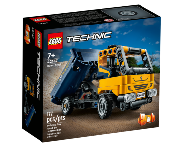

# LEGO Technic

[Téma Technic](https://www.lego.com/en-us/themes/technic) — nosníky, převody a realistická vozidla; navazuje na [Lego_Education.md](./Lego_Education.md) pro motorizované/STEAM sady.

Katalog: [Brickset — Technic](https://brickset.com/sets/theme-Technic)

## Sety

### Safari Racer / Rally Shock n' Roll Racer (8840)

- 1991 Technic auto
- [Návod (lokální PDF)](./manuals/Lego_8840%20Technic%20Safari%20Racer.pdf)
- [Návod — manuall.co.uk](https://manuall.co.uk/lego-set-8840-technic-safari-racer/)
- [Rebrickable — 8840-1](https://rebrickable.com/sets/8840-1/rally-shock-n-roll-racer/?inventory=2#parts)

### Dump Truck (42147)

- 2023 Technic
- [Rebrickable — 42147-1](https://rebrickable.com/sets/42147-1/dump-truck/)

