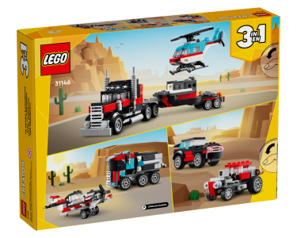
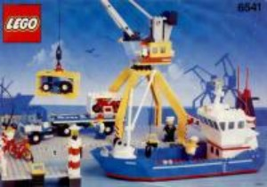
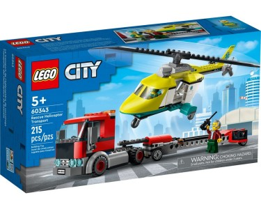
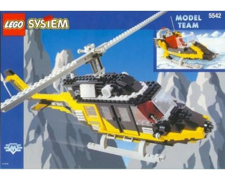
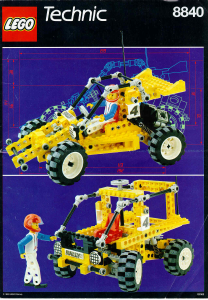
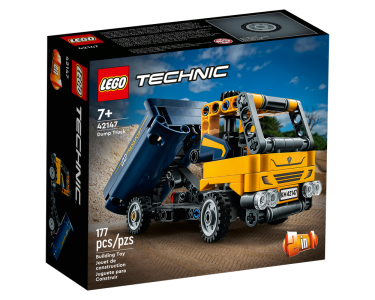

# LEGO

## Lego Gallery

  <a href="Lego_City.md" style="color: white; text-decoration: none;">LEGO Creator</a>

  

    
    
🚛 Flatbed Truck

  

  

    
    
 Transport

  

  

    
    
High Contrast

  

  <a href="Lego_City.md" style="color: white; text-decoration: none;">LEGO City</a>

  

    
    
🛳️ Intercoastal Seaport

  

  

    
    
🚁 Rescue Transport

  

  

    
    
High Contrast

  

  <a href="Lego_System.md" style="color: white; text-decoration: none;">LEGO SYSTEM</a>

  

    
    
🚁 Black Thunder

  

  

    
    
Dark Mode

  

  

    
    
High Contrast

  

  <a href="Lego_Technic.md" style="color: white; text-decoration: none;">LEGO TECHNIC</a>

  

    
    
🏎️ Safari Racer

  

  

    
    
🚚 Dump Truck

  

  

    
    
High Contrast

  

## Lego Shopping List

- [lego wedo 2 0 set - Buy lego wedo 2 0 set with free shipping on AliExpress](https://www.aliexpress.com/w/wholesale-lego-wedo-2-0-set.html?spm=a2g0o.productlist.discover_more.9.71e0a2ceD9n4xz)

- [9686 High-Tech parts multi Technology MOC Parts Educational school students Learning Building Blocks power function Set for kids - AliExpress 26](https://www.aliexpress.com/item/1005001398761348.html?spm=a2g0o.productlist.main.39.2691EsT4EsT4PD&algo_pvid=6825c71f-26b5-4105-9aaf-72ae50961c56&aem_p4p_detail=2024092411385210519601914431480010345980&algo_exp_id=6825c71f-26b5-4105-9aaf-72ae50961c56-19&pdp_npi=4%40dis%21CZK%213492.88%21698.62%21%21%21150.79%2130.16%21%40211b8f9b17272031328455003ef76f%2112000015942767620%21sea%21CZ%212302846117%21ACX&curPageLogUid=swY46JFRaFep&utparam-url=scene%3Asearch%7Cquery_from%3A&search_p4p_id=2024092411385210519601914431480010345980_5)
- [NEW WeDo 2nd Generation Robotics Construction STEAM for Scratch 3.0 Core Set Building Blocks Technical Brick Educational Toy - AliExpress 26](https://www.aliexpress.com/item/1005007003420271.html?spm=a2g0o.detail.pcDetailTopMoreOtherSeller.3.28dbmGWwmGWweL&gps-id=pcDetailTopMoreOtherSeller&scm=1007.40050.354490.0&scm_id=1007.40050.354490.0&scm-url=1007.40050.354490.0&pvid=0bed0b72-6fb0-4b05-930d-8c957bf8ef4b&_t=gps-id:pcDetailTopMoreOtherSeller,scm-url:1007.40050.354490.0,pvid:0bed0b72-6fb0-4b05-930d-8c957bf8ef4b,tpp_buckets:668%232846%238114%231999&pdp_npi=4%40dis%21CZK%211132.21%21551.91%21%21%21345.09%21168.22%21%40210385a817272031576862024ee84b%2112000039015994127%21rec%21CZ%212302846117%21ACX&utparam-url=scene%3ApcDetailTopMoreOtherSeller%7Cquery_from%3A)
- [NEW Educational and Dacta Mindstorms WeDo Building Blocks Kit WeDo 2.0 Core Set Compatible 45300 STEAM DIY Bricks Toy Xmas Gifts - AliExpress 26](https://www.aliexpress.com/item/1005005873249719.html?spm=a2g0o.productlist.main.31.2691EsT4EsT4PD&algo_pvid=6825c71f-26b5-4105-9aaf-72ae50961c56&aem_p4p_detail=2024092411385210519601914431480010345980&algo_exp_id=6825c71f-26b5-4105-9aaf-72ae50961c56-15&pdp_npi=4%40dis%21CZK%214220.12%211180.82%21%21%211286.27%21359.91%21%40211b8f9b17272031328455003ef76f%2112000034663597159%21sea%21CZ%212302846117%21ACX&curPageLogUid=7unfJglHhwu8&utparam-url=scene%3Asearch%7Cquery_from%3A&search_p4p_id=2024092411385210519601914431480010345980_4)

## Part catalog

- [Propeller 4 Blade 5 Diameter 5 x 5 with Center Hole for Rotor Holder : Part 3461 | BrickLink](https://www.bricklink.com/v2/catalog/catalogitem.page?P=3461&utm_source=rebrickable#T=S&O={%22pi%22:%222%22,%22iconly%22:0})
- [LEGO PART 4150pr0014 Tile Round 2 x 2 with Black Grid Large Print - White | Rebrickable - Build with LEGO](https://rebrickable.com/parts/4150pr0014/tile-round-2-x-2-with-black-grid-large-print/15/)

