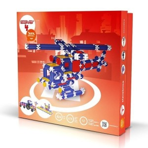

# Seva

Česká stavebnice **Seva** (tyče, kolíky, destičky) — prostorová stavba, často ve školách.

## Návod

- [SEVA 4 — celý průvodce (PDF)](./manuals/SEVA-4-celý-návod-web.pdf)

## V naší sbírce

- Doplňovat variantu sady (např. Seva 4 Uni) a poznámky k projektům podle potřeby.
